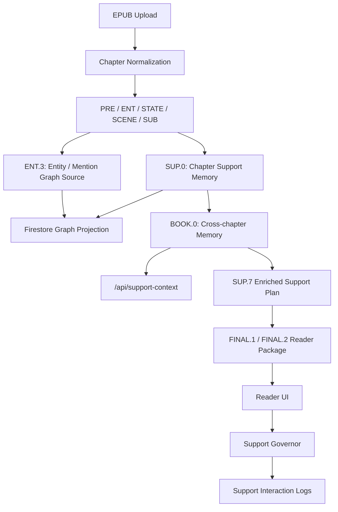

# 2026-05-10 미팅자료: 최근 구현 내용 정리

## 0. 한 문장 요약

이번 구현의 핵심은 기존의 "챕터별 요약/이미지/카드 생성"에서 벗어나, 독자의 현재 reading position에서 필요한 맥락만 cross-chapter memory와 graph-derived support로 복구하는 방향으로 시스템을 확장한 것이다.

발표에서 가장 강조할 문장은 다음과 같다.

> 이 시스템은 소설을 단순히 요약하거나 시각화하는 것이 아니라, 독자의 현재 위치에서 흔들린 situation model을 evidence-grounded narrative memory로 복구하도록 돕는 reader-support system이다.

## 1. 전체 방향 변화

| 이전 관점 | 현재 구현 이후 관점 |
|---|---|
| 장면별 raw summary를 만든다. | 현재 장면 이해에 필요한 최소 support를 고른다. |
| VIS나 support card를 많이 생성한다. | support의 usefulness, intrusion, spoiler risk를 보고 보여줄지 결정한다. |
| 챕터 내부 결과만 사용한다. | BOOK.0 cross-chapter memory로 이전 챕터의 사건, 장소, 인물 thread를 연결한다. |
| SUP.7이 최종 카드 묶음이다. | SUP.7은 Reader가 사용할 display plan이며, 실제 노출은 Support Governor가 조절한다. |
| 그래프는 디버그/확인용이다. | 그래프와 memory는 reader support retrieval의 원천 데이터가 된다. |

연구적으로는 "소설용 RAG/KG를 만들었다"보다 다음 주장이 더 방어 가능하다.

> Reader-position-aware narrative graph와 cross-chapter memory를 이용해, 현재 독자의 situation model 복구에 필요한 spoiler-safe, evidence-grounded, low-intrusion support를 제공한다.

## 2. 현재 시스템 흐름



이 흐름에서 중요한 변화는 BOOK.0과 support-context API가 생기면서, 챕터 단위 산출물이 Reader 화면에서 cross-chapter support로 연결되기 시작했다는 점이다.

## 3. 구현된 주요 기능

### 3.1 EPUB chapter normalization

EPUB에서 표지, TOC, copyright, Project Gutenberg header/footer 같은 비본문 항목이 챕터처럼 잡히는 문제를 줄이기 위해 ingest normalization layer를 추가했다.

| 항목 | 구현 내용 |
|---|---|
| 비본문 필터링 | cover, nav, toc, copyright, pg-header, pg-footer 계열 spine item을 chapter 생성 전 제외한다. |
| 기존 문서 보정 | 이미 저장된 문서도 `listChapters` 단계에서 header/footer성 chapter를 숨긴다. |
| 제목 정규화 | TOC title, HTML heading, non-generic manifest title, heading-like paragraph, sequential fallback 순서로 display title을 고른다. |
| 표시 번호 | raw EPUB index인 `Chapter 3 - ...` 대신, 필터링된 실제 챕터 목록 기준으로 `1. ...`, `2. ...`처럼 보여준다. |
| 메타데이터 보존 | `RawChapter.source`에 `manifest_id`, `original_title`, `toc_title`, `heading_title`, `classification`, `classification_reason`, `source_unit_ids`를 저장한다. |

관련 구현 위치:

| 파일 | 역할 |
|---|---|
| `src/lib/chapter-normalization.ts` | chapter classification, title normalization |
| `src/lib/epub.ts` | EPUB parsing과 normalized chapter 생성 |
| `src/lib/firestore.ts` | chapter 저장/조회 시 normalization metadata 처리 |
| `src/app/api/chapters/route.ts` | UI에서 쓰는 chapter list 반환 |

현재 한계는 TOC anchor 기반으로 하나의 긴 spine item을 여러 의미 챕터로 쪼개는 기능은 아직 없다는 점이다. 지금은 비본문 필터링과 제목 정규화가 우선 구현된 상태다.

### 3.2 Pipeline graph와 stage 실행 UI

기존 linear stage list만으로는 pipeline 구조를 파악하기 어려워서 graph 형태의 stage navigator를 추가하고, 화면 크기가 작을 때도 실행 영역이 잘리지 않도록 레이아웃을 조정했다.

| 항목 | 구현 내용 |
|---|---|
| graph navigator | PRE, ENT, STATE, SCENE, SUB, SUP, FINAL 흐름을 그래프처럼 보여준다. |
| stage 선택 | 사용자가 그래프에서 stage를 선택하고, 해당 stage inspector와 실행 버튼으로 이동할 수 있다. |
| run all / remaining | 전체 실행뿐 아니라 남은 stage 실행도 지원한다. |
| responsive layout | 작은 창에서 graph와 stage 실행 영역이 아래로 잘리지 않도록 height/scroll 구조를 조정했다. |
| VIS stage 정리 | 현재 사용하지 않는 VIS stage가 active stage 선택 목록에 과도하게 노출되지 않도록 정리했다. |

관련 구현 위치:

| 파일 | 역할 |
|---|---|
| `src/components/PipelineRunner.tsx` | pipeline 실행 UI, graph navigator, inspector |
| `src/config/pipeline-graph.ts` | stage dependency와 graph 구조 |
| `src/types/ui.ts` | UI에서 사용하는 stage/run 타입 |

### 3.3 SUP.0 - SUP.7 reader support branch

SUP branch는 단순 카드 생성기가 아니라, reader support를 만들기 위한 중간 artifact pipeline으로 유지할 가치가 있다.

| Stage | 현재 역할 |
|---|---|
| `SUP.0` | scene, event, edge 기반 chapter-local support memory 생성 |
| `SUP.1` | scene별 shared support context 구성 |
| `SUP.2` | current-state snapshot과 boundary delta 후보 생성 |
| `SUP.3` | 이전 사건과 현재 장면을 잇는 causal bridge 후보 생성 |
| `SUP.4` | character focus와 relation 변화 후보 생성 |
| `SUP.5` | re-entry, reference repair, spatial/visual cue 후보 생성 |
| `SUP.6` | selected/deferred unit을 나누는 policy selection |
| `SUP.7` | Reader display slot과 display plan으로 package 구성 |

현재 중요한 점은 SUP.7이 BOOK.0 cross-chapter memory를 읽어서 chapter-local support plan을 보강한다는 것이다. 즉 SUP.7은 더 이상 현재 챕터의 SUP.6 결과만 포장하지 않고, 현재 scene 이전까지 spoiler-safe하게 연결 가능한 cross-chapter edge를 support 후보로 넣는다.

관련 구현 위치:

| 파일 | 역할 |
|---|---|
| `src/lib/pipeline/support.ts` | SUP.0 - SUP.7 생성 로직 |
| `src/app/api/pipeline/sup0/route.ts` - `src/app/api/pipeline/sup7/route.ts` | stage별 API route |
| `src/app/api/pipeline/final1/route.ts` | SUP.7 결과를 FINAL.1 reader package에 연결 |
| `src/types/schema.ts` | stage artifact와 support unit schema |

### 3.4 BOOK.0 cross-chapter memory

챕터별 run이 서로 다르기 때문에, BOOK.0을 만들 때 각 챕터에서 어떤 run을 사용할지 선택할 수 있게 했다.

| 항목 | 구현 내용 |
|---|---|
| run 선택 | 챕터별로 SUP.0-ready run을 자동 선택하거나 수동 선택할 수 있다. |
| snapshot 생성 | 선택된 챕터 run들의 SUP.0 결과를 모아 `book_memories` snapshot을 만든다. |
| cross-chapter edge | scene path, causal edge, place shift, same-place, character thread 같은 연결을 구성한다. |
| missing 표시 | 필요한 SUP.0 결과가 없는 챕터는 missing 상태로 표시한다. |
| Reader 연결 | Reader 화면에서 현재 scene 기준 cross-chapter memory panel을 보여준다. |

Firestore 저장 위치:

```text
documents_v2/{docId}/book_memories/{bookRunId}
```

관련 구현 위치:

| 파일 | 역할 |
|---|---|
| `src/lib/book-memory.ts` | BOOK.0 snapshot build/load |
| `src/types/book-memory.ts` | BookMemorySnapshot 타입 |
| `src/app/api/book-memory/route.ts` | BOOK.0 build/load API |
| `src/components/BookMemoryPanel.tsx` | Graph 탭의 chapter-run 선택과 snapshot 생성 UI |

### 3.5 Knowledge graph query layer

현재 graph layer는 Neo4j 같은 전용 graph DB가 아니라 Firestore projection이다. 지금 단계에서는 별도 graph DB 도입보다, stage artifact를 query 가능한 node/edge projection으로 materialize하는 것이 목적이다.

| 항목 | 구현 내용 |
|---|---|
| projection source | `ENT.3`와 `SUP.0` artifact를 graph source로 사용한다. |
| node/edge 저장 | entity, mention, scene, event, place, relation성 정보를 Firestore node/edge로 투영한다. |
| Graph 탭 | graph projection을 rebuild/load하고, node/edge를 탐색할 수 있다. |
| BOOK.0 연계 | BOOK.0은 graph와 별도로 cross-chapter memory snapshot을 만들지만, 둘 다 SUP.0을 핵심 원천으로 쓴다. |

관련 구현 위치:

| 파일 | 역할 |
|---|---|
| `src/lib/knowledge-graph.ts` | graph projection build/query |
| `src/types/graph.ts` | graph node/edge 타입 |
| `src/app/api/knowledge-graph/route.ts` | graph API |
| `src/components/KnowledgeGraphExplorer.tsx` | Graph 탭 UI |

현재 수준은 "graph query가 가능한 projection layer"다. 아직 완성된 document-level Narrative Relation Graph나 복잡한 graph traversal engine은 아니다.

### 3.6 Support context retrieval API

BOOK.0을 Reader와 support generation에 연결하기 위해 `/api/support-context`를 추가했다.

예시:

```text
GET /api/support-context?docId={DOC_ID}&chapterId=ch08&sceneId=scene_01&supportKind=all
```

반환 의도:

| 필드 | 의미 |
|---|---|
| current scene | 현재 chapter/scene의 위치와 요약 정보 |
| incoming/outgoing edges | 현재 scene과 연결되는 이전/이후 edge |
| causal edges | 인과 bridge 후보 |
| place chain | 장소 연속성 후보 |
| entity threads | 반복 등장 인물/엔티티 thread |
| nearby scenes | 현재 위치 주변 scene path |
| evidence refs | support가 근거로 삼을 수 있는 stage/source reference |

관련 구현 위치:

| 파일 | 역할 |
|---|---|
| `src/lib/support-context.ts` | BOOK.0에서 현재 scene 기준 context 추출 |
| `src/types/support-context.ts` | SupportContext 타입 |
| `src/app/api/support-context/route.ts` | support context API |

중요한 점은 이 API가 generic RAG처럼 "비슷한 chunk top-k"를 주는 것이 아니라, 현재 reader position과 scene key를 기준으로 story memory를 필터링한다는 것이다.

### 3.7 Support scoring schema와 Support Governor

SupportUnit에 단순 priority만 두면 "중요하지만 너무 방해되는 support"와 "짧지만 실제 도움 안 되는 support"를 구분하기 어렵다. 그래서 support unit과 runtime policy에 필요한 점수 필드를 추가했다.

추가/사용하는 핵심 개념:

| 필드 | 의미 |
|---|---|
| `reader_problem` | boundary update, state recovery, causal gap, spatial disorientation 등 어떤 독자 문제를 다루는지 |
| `confidence` | 해당 support가 맞을 가능성 |
| `grounding_score` | evidence가 support claim을 얼마나 지지하는지 |
| `usefulness_score` | 현재 scene 이해에 실제 도움이 될 가능성 |
| `intrusion_cost` | 본문 흐름을 방해할 가능성 |
| `spoiler_risk` | 현재 reader position에서 reveal-safe한지 |
| `redundancy_key` | 중복 support 억제를 위한 key |

Support Governor의 현재 정책:

| 정책 | 현재 구현 |
|---|---|
| 기본 노출 제한 | visible support는 최대 1개로 제한한다. |
| on-demand 우선 | causal, cross-chapter, relation성 support는 기본적으로 접어둔다. |
| re-entry 고려 | session gap이 있을 때 re-entry recap 계열 support를 노출 후보로 올린다. |
| VIS 억제 | visual usefulness가 낮으면 visual_context support를 runtime-suppressed로 본다. |
| 하위 호환 | display_plan이 없는 기존 artifact도 기존 slot 기반으로 읽을 수 있게 유지한다. |

관련 구현 위치:

| 파일 | 역할 |
|---|---|
| `src/lib/support-governor.ts` | runtime support display decision |
| `src/lib/visual-support-policy.ts` | VIS usefulness score와 default/minimized 판단 |
| `src/types/schema.ts` | support unit scoring field |
| `src/components/ReaderScreen.tsx` | Reader에서 governor 적용 |

### 3.8 Reader UI 개선

Reader 화면은 "분석 결과를 모두 보여주는 화면"이 아니라, 본문 읽기를 우선하고 필요한 support만 점진적으로 열 수 있는 구조로 조정했다.

| 영역 | 현재 동작 |
|---|---|
| 본문 위 support | Support Governor가 고른 가장 중요한 support 0-1개만 노출한다. |
| Cross-chapter Memory | 현재 scene과 연결되는 bridge, thread, path를 보여준다. |
| More reading support | causal/relation/cross-chapter support를 접힌 on-demand 영역에 둔다. |
| Visual support | usefulness가 높을 때만 기본 노출하고, 낮으면 minimized 영역으로 보낸다. |
| Subscene View | 연구자/디버그 확인용 성격이 강하므로 기본 독서 흐름과 분리된 details 구조로 둔다. |
| Cast / place cues | 기본 독서 지원이라기보다 보조 cue이므로 접을 수 있는 영역으로 유지한다. |

Cross-chapter Memory panel이 잘려 보이는 문제도 layout을 수정했다. 오른쪽 rail 전체를 sticky/internal scroll로 묶지 않고, 패널별로 필요한 부분만 scroll되도록 조정했다.

관련 구현 위치:

| 파일 | 역할 |
|---|---|
| `src/components/ReaderScreen.tsx` | Reader layout, cross-chapter memory, support rendering |
| `src/lib/support-governor.ts` | 표시 정책 |
| `src/lib/visual-support-policy.ts` | VIS 표시 정책 |

### 3.9 Interaction logging

Reader에서 support가 실제로 노출되거나 사용자가 연 support를 기록하기 시작했다. 이 로그는 나중에 정성 연구와 policy ablation의 근거가 된다.

Firestore 저장 위치:

```text
documents_v2/{docId}/support_events/{eventId}
```

현재 기록하는 이벤트:

| action | 의미 |
|---|---|
| `shown` | Reader 화면에서 support가 기본 노출됨 |
| `opened` | 사용자가 접힌 support 영역을 열어봄 |

저장 필드:

| 필드 | 의미 |
|---|---|
| `doc_id`, `session_id` | 문서와 독서 세션 식별 |
| `chapter_id`, `scene_id`, `scene_key` | reader position |
| `reader_run_id` | 어떤 reader package run에서 나온 support인지 |
| `unit_id`, `unit_kind`, `reader_problem` | 어떤 support가 사용되었는지 |
| `action`, `reason`, `created_at` | 이벤트 종류와 시간 |

관련 구현 위치:

| 파일 | 역할 |
|---|---|
| `src/app/api/support-events/route.ts` | support event 저장/조회 API |
| `src/components/ReaderScreen.tsx` | shown/opened logging 호출 |

### 3.10 Storage v2와 legacy 분리

기존 Firestore `documents` 컬렉션을 직접 rename할 수 없어서, 새 실행은 `documents_v2`에 저장하고 기존 데이터는 legacy 탭에서 읽는 방식으로 정리했다.

| 항목 | 현재 상태 |
|---|---|
| 새 실행 | `documents_v2` 사용 |
| 기존 데이터 | `documents`를 legacy read-only 성격으로 유지 |
| run 결과 | 각 chapter/run/stage artifact로 저장 |
| run 선택 | chapter마다 runId가 다르므로, BOOK.0에서 chapter-run 선택 UI를 제공 |
| favorite run | 유의미한 run을 표시할 수 있음 |

이 구조 덕분에 이전 버전 데이터를 완전히 버리지 않고, 새 데이터 저장 구조는 중복을 줄이는 방향으로 갈 수 있다.

### 3.11 UI language mode

웹사이트의 안내문구, 버튼, 라벨을 한국어/영어로 전환할 수 있는 i18n layer를 추가했다.

| 항목 | 구현 내용 |
|---|---|
| 언어 전환 | 오른쪽 위 `KO` / `EN` 버튼 |
| 저장 | `localStorage`의 `story-visualization:ui-locale`에 저장 |
| document lang | 선택 언어에 따라 `document.documentElement.lang`을 `ko` 또는 `en`으로 갱신 |
| string catalog | UI 문구를 `src/lib/ui-strings.ts`에서 관리 |
| 범위 | 앱 안내문구, 버튼, 라벨, empty state 중심 |
| 제외 | 책 본문, 챕터 제목, LLM output, stage artifact data는 번역하지 않음 |

관련 구현 위치:

| 파일 | 역할 |
|---|---|
| `src/lib/ui-strings.ts` | KO/EN string catalog |
| `src/components/LanguageProvider.tsx` | 전역 language context와 switcher |
| `src/app/page.tsx` | header language switcher와 주요 화면 copy 연결 |
| `src/components/*.tsx` | Upload, Graph, Pipeline, Reader, Book Memory 등의 copy 적용 |

## 4. 데모 시나리오

미팅에서 보여주기 좋은 순서는 다음과 같다.

### 4.1 EPUB ingest 결과 확인

1. Alice 문서를 선택한다.
2. Chapter 목록에서 cover/header/footer가 빠졌는지 확인한다.
3. 제목이 `item3` 같은 manifest ID가 아니라 `1. CHAPTER I. Down the Rabbit-Hole`처럼 표시되는지 보여준다.

확인 API:

```text
GET /api/chapters?docId={DOC_ID}
```

### 4.2 Pipeline graph 확인

1. Pipeline 탭에서 stage graph를 보여준다.
2. SUP branch가 PRE/ENT/STATE/SCENE/SUB 이후 reader support branch로 붙어 있음을 설명한다.
3. 이미 실행한 챕터라면 SUP.7, FINAL.1, FINAL.2 결과를 inspector에서 확인한다.

강조할 점:

```text
SUP.0은 graph/memory 원천이고,
SUP.1~SUP.7은 reader-facing support 후보와 display plan을 만드는 branch다.
```

### 4.3 BOOK.0 cross-chapter memory 확인

1. Graph 탭의 Book Memory panel로 이동한다.
2. 챕터별 run 선택 UI를 보여준다.
3. snapshot의 scenes, edges, entity threads 개수를 확인한다.
4. missing chapter가 없거나, 어떤 챕터가 준비되지 않았는지 status badge로 확인한다.

확인 API:

```text
GET /api/book-memory?docId={DOC_ID}
```

### 4.4 Support context API 확인

브라우저에서 다음 형태로 직접 호출한다.

```text
GET /api/support-context?docId={DOC_ID}&chapterId=ch08&sceneId=scene_01&supportKind=all
```

확인할 포인트:

| 응답 요소 | 설명할 내용 |
|---|---|
| current scene | 현재 reader position 기준으로 context를 잡는다. |
| incoming/outgoing edges | 전체 요약이 아니라 현재 scene과 연결되는 edge만 가져온다. |
| entity threads | 반복 등장 인물/엔티티의 이전 등장 맥락을 가져온다. |
| place chain | 장소 이동이나 재진입 맥락을 복구할 수 있다. |
| safety filter | 현재 위치 이후의 spoiler성 정보는 제외하는 방향으로 설계되어 있다. |

### 4.5 Reader 화면 확인

1. Reader 탭에서 동일 챕터/scene을 연다.
2. 본문 위에는 support가 과도하게 뜨지 않고 0-1개만 보이는지 확인한다.
3. Cross-chapter Memory panel에서 bridge/thread/path가 보이는지 확인한다.
4. More reading support를 열어서 on-demand support가 분리되어 있는지 확인한다.
5. Visual support가 무조건 노출되지 않고 usefulness에 따라 기본 노출 또는 minimized 처리되는지 확인한다.
6. Subscene View와 Cast/place cues는 삭제하지 않고 보조/디버그 성격의 접힌 영역으로 남겨둔 점을 설명한다.

### 4.6 Interaction logging 확인

Reader에서 support가 보이거나 on-demand 영역을 열면 support event가 저장된다.

확인 API:

```text
GET /api/support-events?docId={DOC_ID}&limit=20
```

이 로그는 추후 "어떤 support가 실제로 노출되었고, 사용자가 어떤 support를 열어보았는가"를 분석하는 기반이 된다.

### 4.7 UI language toggle 확인

1. 오른쪽 위 `KO` / `EN` 버튼을 누른다.
2. 앱 안내문구와 버튼이 바뀌는지 보여준다.
3. 책 본문과 LLM 결과는 번역 대상이 아니라 원문/산출물 보존 대상임을 설명한다.

## 5. 현재 구현의 연구적 의미

### 5.1 단순 요약과의 차이

Generic summary는 "무슨 일이 있었는가"를 말한다. 현재 시스템이 목표로 하는 support는 "현재 장면을 이해하기 위해 무엇을 다시 기억해야 하는가"를 고른다.

예시:

| 방식 | 출력 |
|---|---|
| Generic summary | Alice가 이상한 방에 들어가 여러 물건을 발견한다. |
| Targeted support | 이전에 Alice는 작은 문을 통과하지 못했다. 그래서 지금 병/케이크 같은 크기 변화 단서가 중요해진다. |

### 5.2 기존 Narrative RAG/KG와의 차이

기존 Narrative RAG는 대체로 질문에 답하기 위한 retrieval/reasoning 시스템이다. 현재 프로젝트는 독자가 명시적으로 질문하지 않아도, 현재 읽기 위치에서 필요한 support를 언제 보여줄지 결정해야 한다.

| 기존 Narrative RAG/KG | 이 프로젝트 |
|---|---|
| QA 중심 | Reader support 중심 |
| user query 중심 | reader position + scene state 중심 |
| answer generation 중심 | show/defer/suppress decision 중심 |
| graph retrieval 정확도 중심 | recovery value와 intrusion cost 동시 고려 |
| spoiler/reveal이 핵심 metadata가 아님 | reveal timing과 spoiler safety가 필수 |

따라서 우리만의 "거대한 새 graph algorithm"이 필요한 것은 아니지만, reader-position-aware narrative memory schema와 retrieval policy는 필요하다.

### 5.3 SUP branch를 유지해야 하는 이유

SUP.0만 있으면 graph projection은 가능하다. 하지만 SUP.0은 raw memory에 가깝다. 독자에게 바로 보여주기에는 너무 구조적이고, 설명 형태가 아니다.

SUP.1 - SUP.7은 이 raw memory를 다음 형태로 바꾸는 단계다.

| raw memory | reader-facing support |
|---|---|
| scene edge | "장소가 바뀌었다." |
| causal edge candidate | "이전 실패 때문에 지금 이 행동이 중요해졌다." |
| active cast edge | "현재 이 장면에서 중심 인물은 Alice다." |
| same-place thread | "이 장소는 이전 장면과 연결된다." |
| entity thread | "이 인물은 이전 챕터에서 이미 등장했다." |

다만 SUP.1 - SUP.7은 최종 정답 카드 생성기가 아니라 candidate generator와 display plan으로 재해석해야 한다.

## 6. 현재 한계와 다음 구현 과제

| 과제 | 현재 상태 | 다음 단계 |
|---|---|---|
| NRG.0 Narrative Relation Graph | Firestore graph projection과 BOOK.0은 있음 | claim-level evidence, scope, reveal metadata를 가진 document-level graph materialization 필요 |
| RET.1 retrieval | `/api/support-context` 1차 구현 | SUP.1 - SUP.7 생성 과정에 retrieval 결과를 더 직접 주입 |
| SUP.V verifier/scorer | scoring field와 governor 기반은 있음 | 별도 verifier stage로 grounding/usefulness/spoiler 검증 강화 |
| Runtime Support Governor | 기본 visible max 1, re-entry gap, VIS suppression 구현 | backscroll, pause, fatigue, repeated open 같은 reader-state signal 추가 |
| Evidence UI | evidence ref는 저장/전달 가능 | support card에서 원문 paragraph highlight로 연결 |
| EPUB splitting | 비본문 필터링과 제목 정규화 구현 | TOC anchor 기반 chapter/section split 추가 |
| VIS policy | usefulness 기반 기본 노출/축소 구현 | VIS artifact 자체에 `visual_usefulness_score`, `visual_primary_role`, `not_reliable_for` 저장 |
| Evaluation dashboard | support event 저장 시작 | shown/opened/suppressed 통계와 scene별 support effectiveness dashboard 필요 |
| i18n 범위 | 주요 UI copy KO/EN 지원 | artifact inspector field label까지 점진 확장 |

## 7. 다음 미팅에서 논의하면 좋은 질문

1. 1차 연구 범위를 Boundary Delta, Current-State Snapshot, Causal Bridge, Re-entry Recap으로 좁히는 것이 적절한가?
2. Cross-chapter Memory panel을 독자 UI에 어느 정도 노출할 것인가, 아니면 연구자/디버그 UI로만 둘 것인가?
3. Support Governor의 기본 정책을 "visible max 1"로 유지할 것인가?
4. VIS는 지금처럼 조건부 modality로 두는 것이 맞는가?
5. 다음 개발 우선순위는 NRG.0 materialization인가, SUP.V verifier인가, evaluation/logging dashboard인가?
6. 기존 Narrative RAG/E2RAG류를 baseline으로 둘 때, 비교 조건을 어떤 방식으로 잡을 것인가?

## 8. 관련 문서

| 문서 | 내용 |
|---|---|
| `docs/source/research/reader-position-aware-recovery-plan.md` | reader-position-aware recovery system 전체 연구/구현 계획 |
| `docs/source/research/narrative-relation-graph.md` | Narrative Relation Graph 설계 |
| `docs/source/implementation/reader-support-pipeline.md` | SUP.0 - SUP.7, BOOK.0, NRG.0, Reader 연결 구현 설명 |
| `docs/source/research/narrative-relation-graph.md` | Narrative Relation Graph 설계 |
| `docs/source/implementation/knowledge-graph-query-layer.md` | Firestore graph projection과 query layer |
| `docs/source/implementation/epub-ingest-normalization.md` | EPUB chapter normalization 구현 |
| `docs/source/implementation/ui-language-mode.md` | KO/EN UI language mode |
| `docs/source/implementation/storage-v2-and-legacy.md` | documents_v2와 legacy documents 분리 |
| `docs/source/implementation/ui-graph-and-reader-support.md` | graph형 pipeline UI와 Reader support UI |

## 9. 발표용 마무리 문장

이번 구현으로 pipeline은 단순히 챕터별 산출물을 쌓는 구조에서, 독자의 현재 위치를 기준으로 이전 챕터의 memory를 검색하고 support를 선택적으로 제공하는 구조로 넘어가기 시작했다.

아직 완성된 Narrative Relation Graph나 fully adaptive Support Governor는 아니지만, `SUP.0`, `BOOK.0`, graph projection, `/api/support-context`, `SUP.7` enrichment, Reader Support Governor, interaction logging이 연결되면서 다음 연구 주장으로 갈 수 있는 최소 end-to-end path가 만들어졌다.

> 다음 단계의 목표는 support를 더 많이 만드는 것이 아니라, 현재 독자에게 필요 없는 support를 숨기고, 필요한 support만 근거와 함께 가장 작은 형태로 제공하는 것이다.
